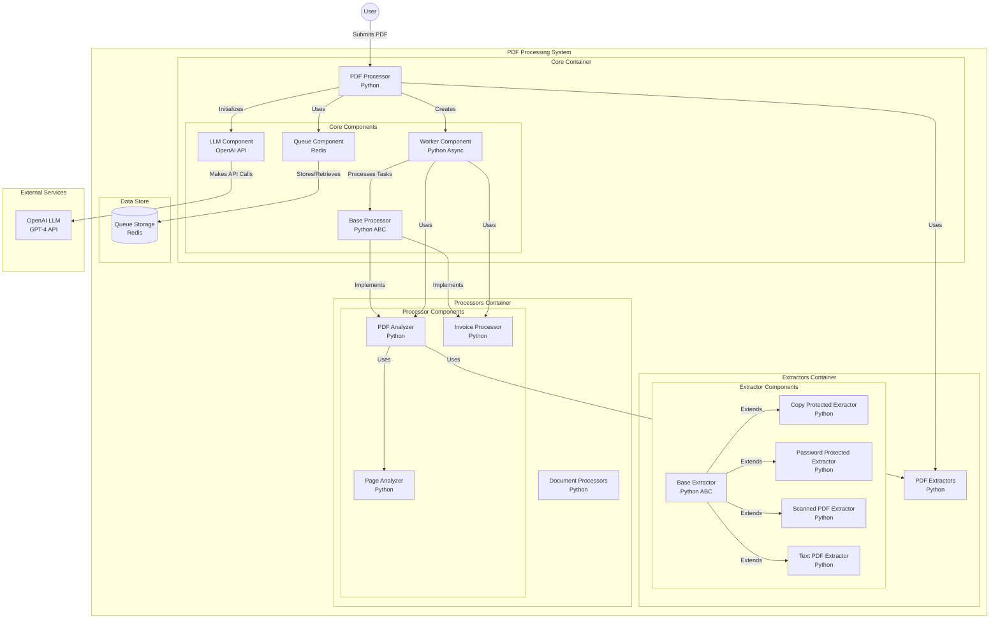

# Function Graph

```mermaid
graph TB
    User((User))

    subgraph "PDF Processing System"
        subgraph "Core Container"
            PDFProcessor["PDF Processor<br>Python"]
            
            subgraph "Core Components"
                LLMComponent["LLM Component<br>OpenAI API"]
                WorkerComponent["Worker Component<br>Python Async"]
                QueueComponent["Queue Component<br>Redis"]
                BaseProcessor["Base Processor<br>Python ABC"]
            end
        end

        subgraph "Extractors Container"
            PDFExtractors["PDF Extractors<br>Python"]
            
            subgraph "Extractor Components"
                BaseExtractor["Base Extractor<br>Python ABC"]
                CopyProtectedExtractor["Copy Protected Extractor<br>Python"]
                PasswordProtectedExtractor["Password Protected Extractor<br>Python"]
                ScannedPDFExtractor["Scanned PDF Extractor<br>Python"]
                TextPDFExtractor["Text PDF Extractor<br>Python"]
            end
        end

        subgraph "Processors Container"
            DocumentProcessors["Document Processors<br>Python"]
            
            subgraph "Processor Components"
                PDFAnalyzer["PDF Analyzer<br>Python"]
                InvoiceProcessor["Invoice Processor<br>Python"]
                PageAnalyzer["Page Analyzer<br>Python"]
            end
        end

        subgraph "Data Store"
            Redis[("Queue Storage<br>Redis")]
        end
    end

    subgraph "External Services"
        OpenAI["OpenAI LLM<br>GPT-4 API"]
    end

    %% User interactions
    User -->|"Submits PDF"| PDFProcessor

    %% Core Container relationships
    PDFProcessor -->|"Initializes"| LLMComponent
    PDFProcessor -->|"Creates"| WorkerComponent
    PDFProcessor -->|"Uses"| QueueComponent
    WorkerComponent -->|"Processes Tasks"| BaseProcessor

    %% Queue relationships
    QueueComponent -->|"Stores/Retrieves"| Redis

    %% Extractor relationships
    BaseExtractor -->|"Extends"| CopyProtectedExtractor
    BaseExtractor -->|"Extends"| PasswordProtectedExtractor
    BaseExtractor -->|"Extends"| ScannedPDFExtractor
    BaseExtractor -->|"Extends"| TextPDFExtractor

    %% Processor relationships
    BaseProcessor -->|"Implements"| PDFAnalyzer
    BaseProcessor -->|"Implements"| InvoiceProcessor
    PDFAnalyzer -->|"Uses"| PageAnalyzer

    %% External service relationships
    LLMComponent -->|"Makes API Calls"| OpenAI

    %% Cross-container relationships
    WorkerComponent -->|"Uses"| PDFAnalyzer
    WorkerComponent -->|"Uses"| InvoiceProcessor
    PDFProcessor -->|"Uses"| PDFExtractors
    PDFAnalyzer -->|"Uses"| PDFExtractors
```
